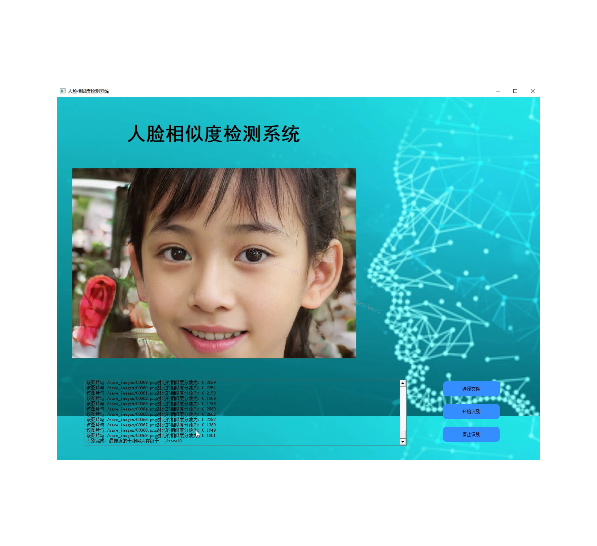
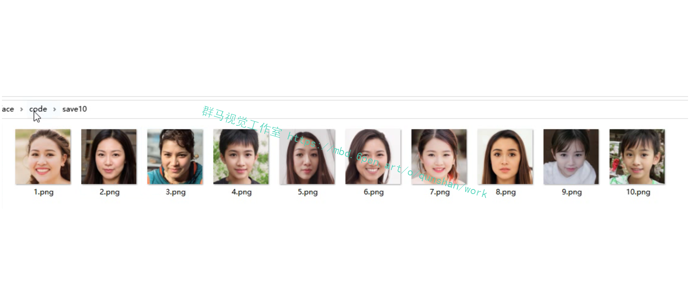
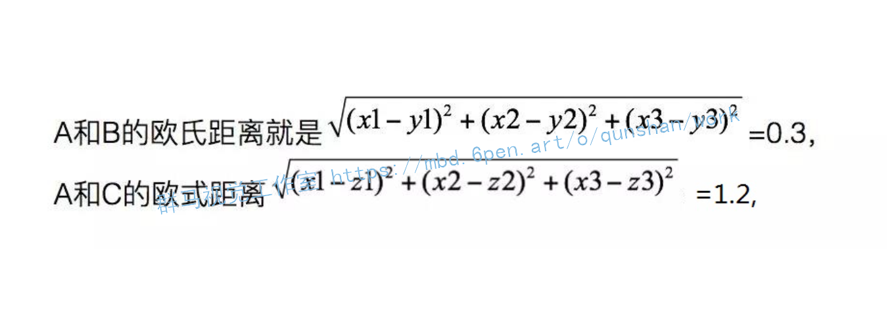
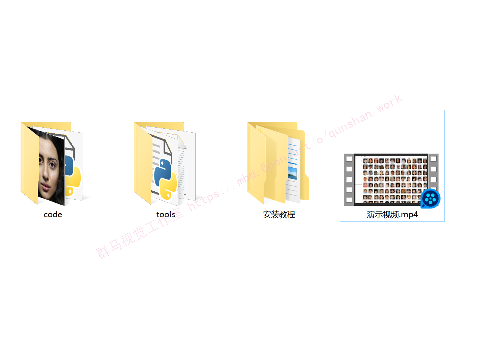


# **1.功能介绍：**

**用户****输入人脸照片****，程序从照片库中****选出10张最相似人脸照片输出在文件夹****中，并且****给出这十张人脸与输入人脸的相似度值****。**

**- 照片库可以增删**

**- 调节相似度阈值可调节**

**- 自定义UI操作界面**

# **2.视频演示：**

[[项目分享]基于OpenCV的人脸集合相似度检测系统(源码＆UI＆教程)_哔哩哔哩_bilibili](https://www.bilibili.com/video/BV1Wa41137CW/?vd_source=bc9aec86d164b67a7004b996143742dc)


# **3.图片演示：**





# **4.人脸相似度对比原理：**
#### 整体思路：

1、预先导入所需要的人脸识别模型；

2、遍历循环识别文件夹里面的图片，让模型“记住”人物的样子；

3、输入一张新的图像，与前一步文件夹里面的图片比对，返回最接近的结果。

#### 使用到的第三方模块和模型：

1、模块：os,dlib,glob,numpy；

2、模型：人脸关键点检测器，人脸识别模型。

#### 导入需要的模型。

这里解释一下两个dat文件：

它们的本质是参数值（即神经网络的权重）。人脸识别算是深度学习的一个应用，事先需要经过大量的人脸图像来训练。[参考该博客，设计一个神经网络结构，来“记住”人类的脸](https://afdian.net/item?plan_id=daff878c5f4011edb19b52540025c377)。

对于神经网络来说，即便是同样的结构，不同的参数也会导致识别的东西不一样。在这里，这两个参数文件就对应了不同的功能（它们对应的神经网络结构也不同）：

shape_predictor.dat这个是为了检测人脸的关键点，比如眼睛，嘴巴等等；dlib_face_recognition.dat是在前面检测关键点的基础上，生成人脸的特征值。

所以后面使用dlib模块的时候，其实就是相当于，调用了某个神经网络结构，[加载该博客提供的预训练权重](https://mbd.pub/o/bread/Y5WUlJxp)，再把预先训练好的参数传给我们调用的神经网络。顺便提一下，在深度学习领域中，往往动不动会训练出一个上百M的参数模型出来，是很正常的事。
```
import os,dlib,glob,numpy
from skimage import io
 
# 人脸关键点检测器
predictor_path = "shape_predictor.dat"
# 人脸识别模型、提取特征值
face_rec_model_path = "dlib_face_recognition.dat"
# 训练图像文件夹
faces_folder_path ='train_images' 
 
# 加载模型
detector = dlib.get_frontal_face_detector()
sp = dlib.shape_predictor(predictor_path)
facerec = dlib.face_recognition_model_v1(face_rec_model_path)
```
#### 对训练集进行识别
```
candidate = []         # 存放训练集人物名字
descriptors = []       #存放训练集人物特征列表
 
for f in glob.glob(os.path.join(faces_folder_path,"*.jpg")):
    print("正在处理: {}".format(f))
    img = io.imread(f)
    candidate.append(f.split('\\')[-1].split('.')[0])
    # 人脸检测
    dets = detector(img, 1)
    for k, d in enumerate(dets): 
        shape = sp(img, d)
        # 提取特征
        face_descriptor = facerec.compute_face_descriptor(img, shape)
        v = numpy.array(face_descriptor) 
        descriptors.append(v)
 
print('识别训练完毕！')
```
当你做完这一步之后，输出列表descriptors看一下，可以看到类似这样的数组，每一个数组代表的就是每一张图片的特征量（128维）。然后我们可以使用L2范式（欧式距离），来计算两者间的距离。

举个例子，比如经过计算后，A的特征值是[x1,x2,x3],B的特征值是[y1,y2,y3], C的特征值是[z1,z2,z3]。

那么由于A和B更接近，所以会认为A和B更像。想象一下极端情况，如果是同一个人的两张不同照片，那么它们的特征值是不是应该会几乎接近呢？知道了这一点，就可以继续往下走了。 

#### 处理待对比的图片。

其实是同样的道理，如法炮制，目的就是算出一个特征值出来，所以和第二步差不多。然后再顺便计算出新图片和第二步中每一张图片的距离，再合成一个字典类型，排个序，选出最小值，搞定收工！
```
try:
##    test_path=input('请输入要检测的图片的路径（记得加后缀哦）:')
    img = io.imread(r".\test_images\test6.jpg")
    dets = detector(img, 1)
except:
    print('输入路径有误，请检查！')
 
dist = []
for k, d in enumerate(dets):
    shape = sp(img, d)
    face_descriptor = facerec.compute_face_descriptor(img, shape)
    d_test = numpy.array(face_descriptor) 
    for i in descriptors:                #计算距离
        dist_ = numpy.linalg.norm(i-d_test)
        dist.append(dist_)
 
# 训练集人物和距离组成一个字典
c_d = dict(zip(candidate,dist))                
cd_sorted = sorted(c_d.items(), key=lambda d:d[1])
print ("识别到的人物最有可能是: ",cd_sorted[0][0])
```


# **5.系统整合：**

下图[完整源码＆环境部署视频教程＆自定义UI界面](https://s.xiaocichang.com/s/fc3048)
参考博客[《Python基于OpenCV的人脸集合相似度检测系统(源码＆UI＆教程)》](https://zhuanlan.zhihu.com/p/561111565)

# **6.参考文献：**

***
*   *[1]*[一种新的人眼定位算法](https://kns.cnki.net/kcms/detail/detail.aspx?filename=HYSK200303018&dbcode=CJFD&dbname=CJFD2003&v=_Qjs37e5DTZXPPXRRj-KlYhWEqDypNUOW2rPX08ztQNydTZBH7y0iwqlxv6W2cK2)[J]. 金名蜚.  淮阴师范学院学报(自然科学版). 2003(03)
*   *[2]*[基于复杂度和最佳阈值的人眼定位方法](https://kns.cnki.net/kcms/detail/detail.aspx?filename=JZDF200801005&dbcode=CJFD&dbname=CJFD2008&v=VMVdncVbKgsSuKQOxA3xBKML47q2NmqVxHNTahr7SIz9ED4SVpiKpSYav6hCyBFI)[J]. 崔连延,徐林,顾树生.  控制工程. 2008(01)
*   *[3]*[复杂背景下基于肤色和几何特征的人眼定位](https://kns.cnki.net/kcms/detail/detail.aspx?filename=JZCK20050300U&dbcode=CJFD&dbname=CJFD2005&v=ikGiI-mM43T8tCQvvnAlT81_dlFq_k7bdnZ3BS3UNNzn-KHyr9PAoQ5jHmXrCmJn)[J]. 李璇,罗敏,施荣华,李丽.  计算机测量与控制. 2005(03)
*   *[4]*[一种基于圆检测的眼睛定位方法](https://kns.cnki.net/kcms/detail/detail.aspx?filename=SDKY200703027&dbcode=CJFD&dbname=cjfd2007&v=PkFMXy-AC0gJJ46Ht_6-krRefBSCWNGosJO4qG7aFf3COx5LcVBImGG5kNZwKTgZ)[J]. 张丹丹,张凌燕,彭延军.  山东科技大学学报(自然科学版). 2007(03)
*   *[5]*[基于图像块复杂度和分段距离函数的人眼定位算法研究](https://kns.cnki.net/kcms/detail/detail.aspx?filename=JZGC201121134&dbcode=CJFD&dbname=CJFD2011&v=qpbc92arNdXcSUmEh9MYYWAiUF41f63RvXdcyH9bOXsbZbPY1U_W6atIEUavSUf2)[J]. 程磊,郑鑫.  价值工程. 2011(21)
*   *[6]*[双目标的无参考图像块内容识别仿真](https://kns.cnki.net/kcms/detail/detail.aspx?filename=JSJZ202011080&dbcode=CJFD&dbname=CJFD2020&v=fZZnlvjuLWOAYuSxOfe0gYHBBiqMjKy64KDz4tQ8yBoKI03PORdwA019d5ZodT3M)[J]. 李春阁,王新强.  计算机仿真. 2020(11)
*   *[7]*[基于视频图像块模型的局部异常行为检测](https://kns.cnki.net/kcms/detail/detail.aspx?filename=NJYD201701005&dbcode=CJFD&dbname=CJFD2017&v=qSZ8rNJMHKduwdp6dpHbi23l5fcKMh8OF8ciZ2yDACZ_zmcpWsfNfWzoVp4UAiUg)[J]. 程艳云,朱松豪,徐国政,梁志伟.  南京邮电大学学报(自然科学版). 2017(01)
*   *[8]*[基于图像块分组的加密域可逆信息隐藏](https://kns.cnki.net/kcms/detail/detail.aspx?filename=BJGD201605012&dbcode=CJFD&dbname=CJFD2016&v=F3uWJrHh_cGSb_iHh0tlfAzgg3oGdmClsBgkGfB1eNEz1RoIakZI2ZO-5099bwqT)[J]. 程航,王子驰,张新鹏.  北京工业大学学报. 2016(05)
*   *[9]*[图像块动态划分矢量量化](https://kns.cnki.net/kcms/detail/detail.aspx?filename=JSJF200502013&dbcode=CJFD&dbname=CJFD2005&v=8STCxsweKN00hj5fPRivEHdjPJVaAaZy4sWGJyAkByLPQnZVDLuxV3A-1NDrbvvc)[J]. 马文龙,余宁梅,银磊,高勇.  计算机辅助设计与图形学学报. 2005(02)
*   *[10]*[一种新的图像中人眼定位方法](https://kns.cnki.net/kcms/detail/detail.aspx?filename=LZTX201103023&dbcode=CJFD&dbname=CJFD2011&v=3TSSwS4jODVhGnf5Zrzemj8g-AFMEavDWKti1W6IBarKIK6OZDUymyvFFhIp3xMp)[J]. 张金敏,孟萍.  兰州交通大学学报. 2011(03)


---
#### 如果您需要更详细的【源码和环境部署教程】，除了通过【系统整合】小节的链接获取之外，还可以通过邮箱以下途径获取:
#### 1.请先在GitHub上为该项目点赞（Star），编辑一封邮件，附上点赞的截图、项目的中文描述概述（About）以及您的用途需求，发送到我们的邮箱
#### sharecode@yeah.net
#### 2.我们收到邮件后会定期根据邮件的接收顺序将【完整源码和环境部署教程】发送到您的邮箱。
#### 【免责声明】本文来源于用户投稿，如果侵犯任何第三方的合法权益，可通过邮箱联系删除。